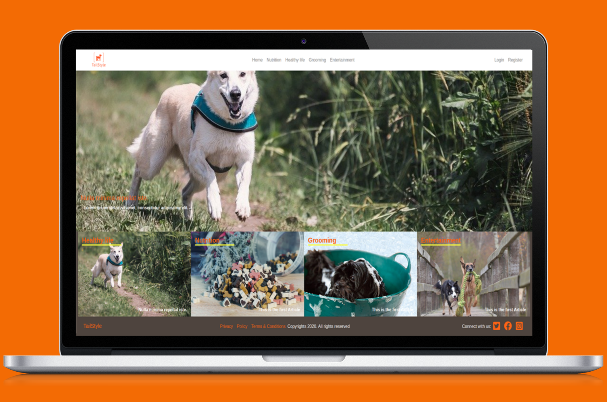

# TailStyle ROR Capstone

> TailStyle web application is based in the design idea of [Nelson Sakwa on Behance](https://www.behance.net/sakwadesignstudio)[Lifestyle](https://www.behance.net/gallery/14554909/liFEsTlye-Mobile-version). It was created for the capstone project for the Ruby on Rails module in the Microverse curriculum.
>You can you can Register with a username, your name, email and password. And then create your new article, but dont forget one or more categories for your article, you can read other peoples article and you can vote for your favorite article. For login you just need your username. 



## Built With

- Ruby v2.7.0
- Ruby on Rails v6
- Rubocop
- Rspec for testing

## Live Demo

- [TailStyle app](https://dry-sea-20225.herokuapp.com/)

## Getting Started

To get a local copy up and running follow these simple example steps.

### Prerequisites

- [Ruby](https://www.ruby-lang.org/en/downloads/)
- [Rails](http://railsinstaller.org/en)
- [Postgres](https://www.postgresql.org/download/)

### Setup

Clone the repository

```
git clone git@github.com:ricardomonte/ROR-Capstone-Tailstyle.git
```

Install gems with:

```
bundle install
```

Install Yarn with:

```
Yarn install
```
Install npm with:

```
npm install
```

Setup database with:

```
Open the terminal in folder where is allocated the repository

    $sudo -u postgres psql
    ALTER USER postgres WITH ENCRYPTED PASSWORD 123456;
    
    * important to dont forget the semicolons

Then run in terminal:

    rails db:create
    rails db:migrate
    rails db:seed

If you receive an error message 'PG::ConnectionBad: FATAL:  password authentication failed for user "postgres"' please follow this instructions

Open the repository

    - Open the file database.yml
    - Coment out in development the username.
    - Change the pasword for your own password

Then run in terminal:

    rails db:create
    rails db:migrate
    rails db:seed
```

### Usage

Start server with:

```
    rails server
```

Open `http://localhost:3000/` in your browser.

### Run tests

```
    rspec --format documentation
```

## Authors

👤 **Ricardo Montenegro**

- Github: [@ricardomonte](https://github.com/ricardomonte)
- Twitter: [@ramnkco](https://twitter.com/ramnkco)
- LinkedIn: [Ricardo Montenegro](https://www.linkedin.com/in/ricantomontenegro/)

## 🤝 Contributing

Contributions, issues and feature requests are welcome!
Feel free to check the issues page.

## Show your support

Give a ⭐️ if you like this project!

## Acknowledgments

- [Microverse](https://www.microverse.org/).
- [Nelson Sakwa on Behance](https://www.behance.net/sakwadesignstudio)[Lifestyle](https://www.behance.net/gallery/14554909/liFEsTlye-Mobile-version)


## 📝 License

This project is [MIT licensed](LICENSE).

